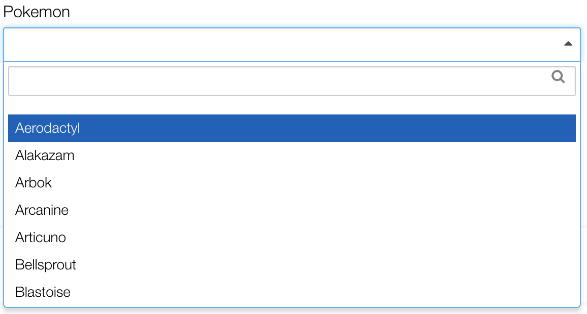

## Dropdowns

### [av-dropdown](https://availity.github.io/availity-angular/pages/ui/#/dropdowns)



Wrapper around [Select2 v3.5.2](https://select2.github.io/select2/). Configure **Select2** through `ng-options`.

```js
ng-options="{ allowClear: false, placeholder: 'Select your favorite number'}"
```

### [Simple](https://availity.github.io/availity-angular/pages/ui/#/simple)
Usage without `ng-options`.

```html
<select id="dropdownSimple" class="form-control" av-dropdown="" ng-model="vm.selectedNumber" ng-options="{ allowClear: false, placeholder: 'Select your favorite number'}">
  <option value="">Select One</option>
  <option value="1">One</option>
  <option value="2">Two</option>
  <option value="3">Three</option>
  <option value="4">Four</option>
  <option value="5">Five</option>
</select>
```

### [Array](https://availity.github.io/availity-angular/pages/ui/#/array)

```javascript
vm.pokemon = ['Aerodactyl', 'Alakazam'];
```

```html
<select 
    id="dropdownPoke" 
    class="form-control" 
    av-dropdown
    ng-model="vm.selectedPoke" 
    ng-options="poke for poke in vm.pokemon" 
    options="{ allowClear: false, placeholder: 'Select a Pokemon'}">
</select>
```

### [Label for Value in Array](https://availity.github.io/availity-angular/pages/ui/#/label-for-value-in-array)

```javascript
vm.states = [
    {
    'name': 'Alabama',
    'id': 'AL'
    },
    {
    'name': 'Alaska',
    'id': 'AK'
    }
];
```

```html
<select 
    id="dropdownStates1" 
    class="form-control" 
    av-dropdown 
    ng-model="vm.selectedState1" 
    ng-options="state.name for state in vm.states" 
    ng-change="vm.onChange(vm.selectedState1)" 
    options="{ allowClear: true, placeholder: 'Select State'}"
>
</select>
```

### [Select as Label for Value in Array](https://availity.github.io/availity-angular/pages/ui/#/select-as-label-for-value-in-array)

```html
<select 
    id="dropdownStates1" 
    class="form-control" 
    av-dropdown="" 
    ng-model="vm.selectedState1" 
    ng-options="state.id as state.name for state in vm.states" 
    ng-change="vm.onChange(vm.selectedState1)" 
    options="{ allowClear: true, placeholder: 'Select State'}">
</select>
```

### [Label for Value in Array Track By](https://availity.github.io/availity-angular/pages/ui/#/label-for-value-in-array-track-by)

```html
<select 
    id="dropdownStates1" 
    class="form-control" 
    av-dropdown
    ng-model="vm.selectedState1" 
    ng-options="state.name for state in vm.states track by state.id" 
    ng-change="vm.onChange(vm.selectedState1)" 
    ptions="{ allowClear: true, placeholder: 'Select State'}">
</select>
```

### [Multiple](https://availity.github.io/availity-angular/pages/ui/#/multiple)

```html
<select 
    id="dropdownMultiple" 
    class="form-control" 
    multiple
    av-dropdown
    ng-model="vm.selectedStates"
    ng-options="state.name for state in vm.states track by state.id"
    ng-change="vm.onChange(vm.selectedStates)"
    options="{ allowClear: true, placeholder: 'Select State'}">
</select>
```

### [Query Large Data-sets](https://availity.github.io/availity-angular/pages/ui/#/query-large-data-sets)

[Select2 v3.5.2](https://select2.github.io/select2/) requires an input field for lazy loading large data sets through queries.  Create a resouce by extending `AvSelectResource` and passing it as options to the input field like below.  Do not use `ng-options` on inputs fields because Angular throws an error. 

```js
class DemoPhotosResource extends AvSelectResource {

  constructor() {
    super({name: 'photos'});
  }

  getResults(response) {
    return response.photos;
  }

  // Optional. Mapping is only need if the item in the collection does not have 
  // "id" and "text" as attributes.  The "text" is the visible label of the option and
  // the "id" is the value.
  mapResult(item) {
    return {
      id: item.id,
      text: item.title
    };
  }

}
```

```js

// vm is the controller in $scope
vm.getOptions() {
  return {
    allowClear: true,
    placeholder: 'Find a photo',
    minimumInputLength: 3,
    query: demoDropdownResource // Injected Angular service
  };
}
```

```html
<div>
  <label for="dropdownQuery">Photos</label>
  <input 
    id="dropdownQuery" 
    class="form-control" 
    av-dropdown
    ng-model="vm.selectedPhoto" 
    ng-change="vm.onChange(vm.selectedPhoto)" 
    options="vm.getOptions()">
</div>
```
