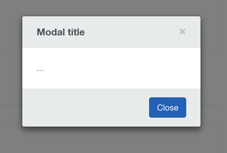

## AvModal




`avModal` is a service that allows the creation of modal windows.  

### Examples

**Constructor**
```js

import tpl from './template';
const modal = new AvModal({
  scope: this.$scope,
  templateUrl: tpl
});
```

**Static**
```js
AvModal.create({
  show: true,
  scope: this.$scope,
  templateUrl: tpl
});
```

## Options

### `show`
Boolean that triggers modal to immediately show upon creation.  Default is `false`.

### `scope`
Pass `$scope` to the modal's controller.

### `templateUrl`
Url or function that loads the template.

### `controller`
Same as Angular controller.

### `controllerAs`
Same as Angular's controller as syntax.

### `locals`
Values become injectable in the controller based on their key names.

```js
AvModal.create({  
  locals: {
    someKey: 'This is a value passed in using locals, they become injectable values into the controller based on their key name.'
  }
});
```

## Methods

### `AvModal.create`
Create a modal window on demand without having to call the contructor.


